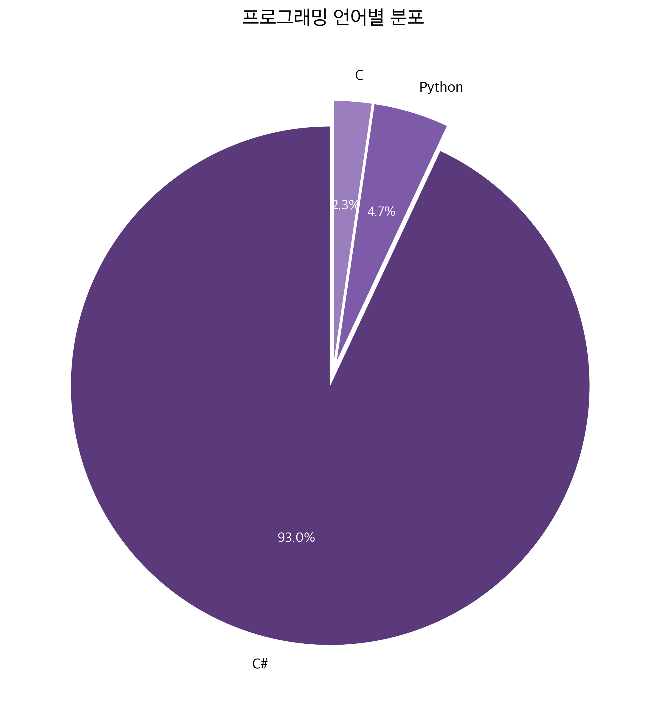
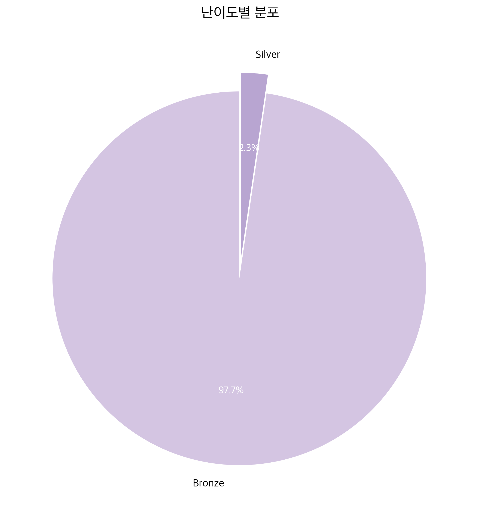

# 🏆 Baekjoon 문제 풀이 현황

> Solved.ac에서 추적하는 알고리즘 문제 풀이 기록

---

## 📊 통계

### 📈 프로그래밍 언어별 분포


### 🎓 난이도별 분포


---

## 📌 요약 정보

### 📊 총 풀이 문제 수

| 통계 | 값 |
|------|-----|
| **이 레포지토리의 풀이** | 43개 |
| **Solved.ac 전체 풀이** | 66개 |

### 🏆 Solved.ac 프로필 정보

| 항목 | 정보 |
|------|------|
| **아이디** | sernn |
| **레이팅** | 201 |
| **티어** | 6 (Silver V) |
| **순위** | 131,317위 |

**🔗 [Solved.ac 프로필 바로가기](https://solved.ac/profile/sernn)**

---
---

## 📂 폴더 구조

Baekjoon-solved/
├── 백준/                          # 풀이한 문제들 (BaekjoonHub 자동 동기화)
│   ├── Bronze/
│   ├── Silver/
│   └── ...
├── statistics/                    # 통계 및 그래프 생성 폴더
│   ├── generate_stats.py          # 통계 생성 스크립트
│   ├── stats.json                 # 통계 데이터 (자동 생성)
│   ├── language_distribution.png  # 언어별 분포 그래프 (자동 생성)
│   └── tier_distribution.png      # 난이도별 분포 그래프 (자동 생성)
├── .github/workflows/
│   └── update-stats.yml           # GitHub Actions 자동 업데이트 설정
└── README.md                      # 이 파일
```

---

## 🚀 자동화 설정

이 레포지토리는 **GitHub Actions**를 통해 자동으로 업데이트됩니다:

1. **BaekjoonHub**에서 새 풀이가 푸시됨
2. **GitHub Actions**가 자동으로 트리거됨
3. 통계 스크립트가 실행되어:
	- 언어별 분포 계산
	- 난이도별 분포 계산
	- Solved.ac 프로필 정보 조회
	- 시각적 그래프 생성
4. 변경사항이 자동으로 커밋 및 푸시됨

---

## 📝 로컬에서 통계 생성하기

```bash
# 1. 저장소 클론
git clone https://github.com/Sernn0/Baekjoon-solved.git
cd Baekjoon-solved

# 2. 필수 패키지 설치
pip install -r requirements.txt

# 3. 통계 생성
python statistics/generate_stats.py
```

---

## 📚 관련 링크

- 🔗 [Solved.ac 프로필](https://solved.ac/profile/sernn)
- 🔗 [BaekjoonHub](https://github.com/BaekjoonHub/BaekjoonHub)
- 🔗 [Solved.ac API](https://solved.ac/api/docs)

---

**마지막 업데이트**: 통계가 자동으로 생성되므로 항상 최신 정보를 유지합니다. ✨

